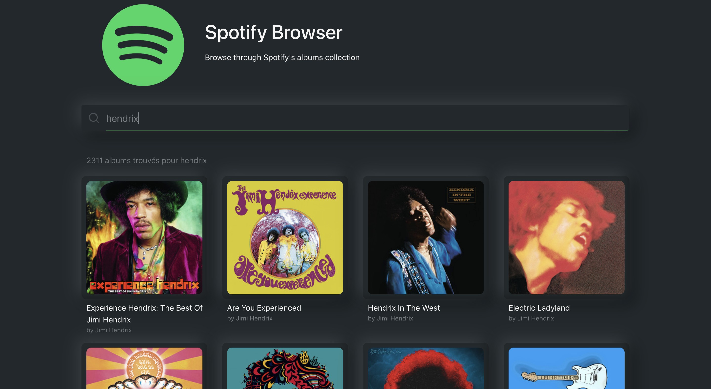

# Spotify Browser

Browse through Spotify's albums collection 🚀

Check out the [live demo](https://alarid.github.io/Spotify-Browser)

## Features
* Search for an artist or an album name
* View Spotify albums matching your query
* Get details about an album: tracklist, release date, artists, total duration

## Spotify API
[Spotify Web API Quick Start](https://developer.spotify.com/documentation/web-api/quick-start/)

Env variables required to run the app:
* REACT_APP_SPOTIFY_API_AUTH_URL = https://accounts.spotify.com/api
* REACT_APP_SPOTIFY_API_URL = https://api.spotify.com/v1
* REACT_APP_SPOTIFY_CLIENT_ID = Your client ID (get one when registering your app)
* REACT_APP_SPOTIFY_CLIENT_SECRET = Your client secret (get one when registering your app)